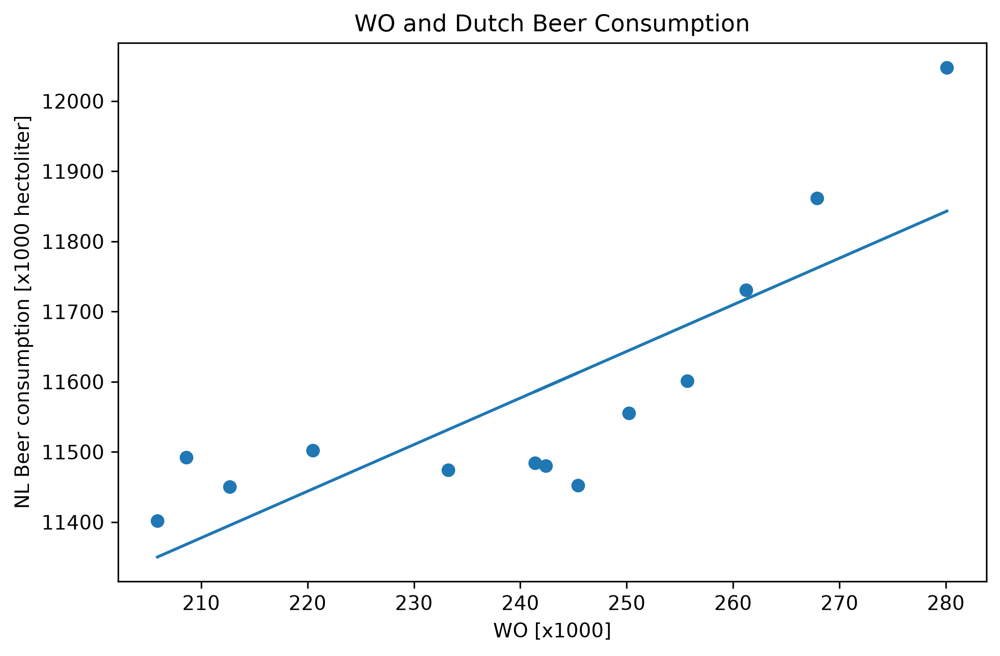

# Computational Scientist's Toolbox Assignment

## Student ID
16944763

## Papers

- *Fantastic yeasts and where to find them: the hidden diversity of dimorphic fungal pathogens*
- *An analysis of the forces required to drag sheep over various surfaces*
- *Correlation of continuous cardiac output measured by a pulmonary artery catheter versus impedance cardiography in ventilated patients*

## Visualization

The plot shows a positive relationship between the two variables. 
However, a correlation between the variables does not necessarily imply 
a causal relationship.
